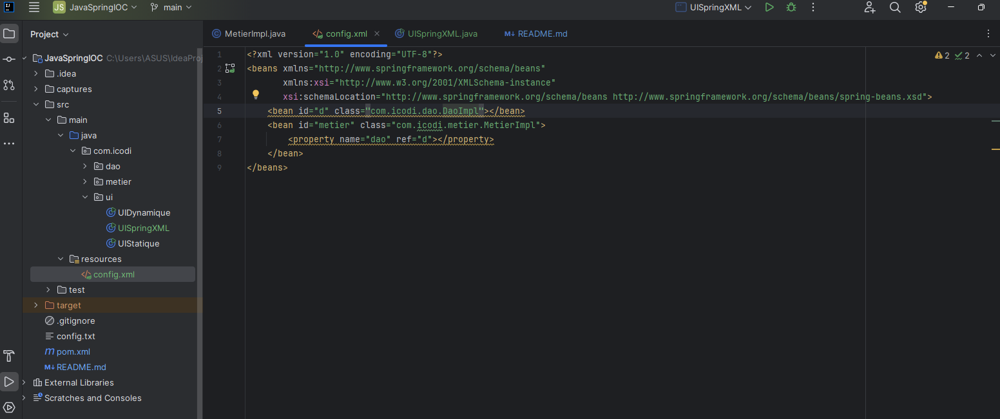
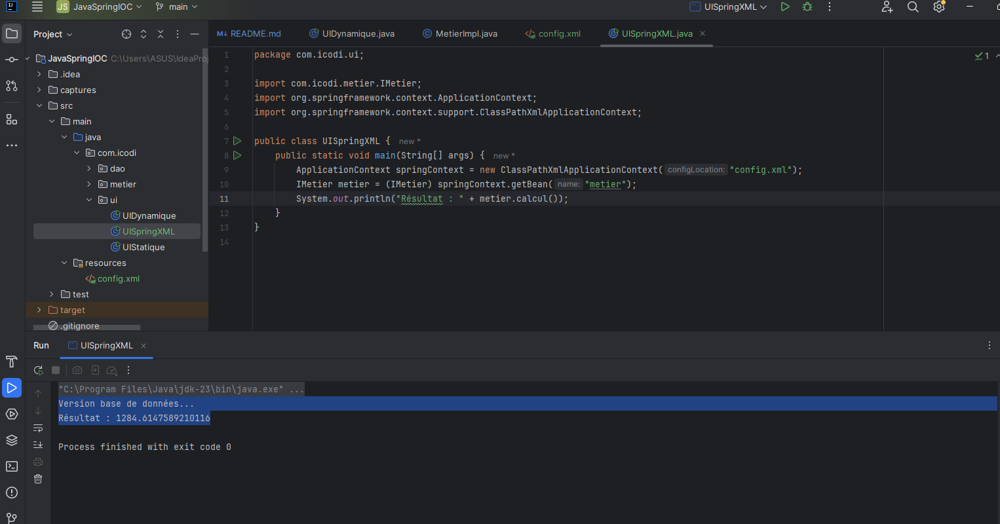
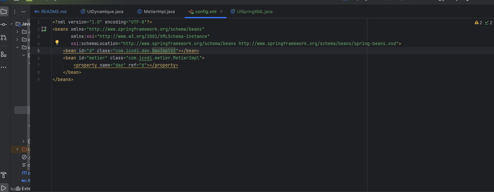
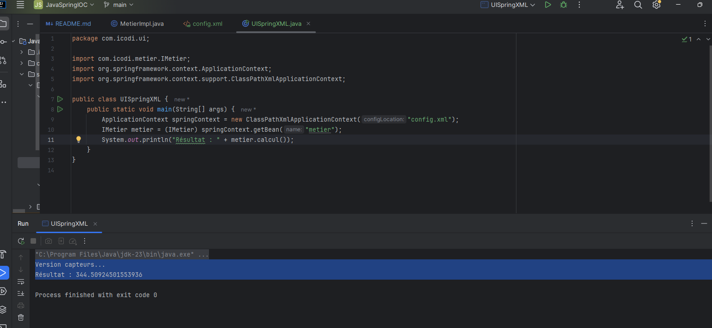
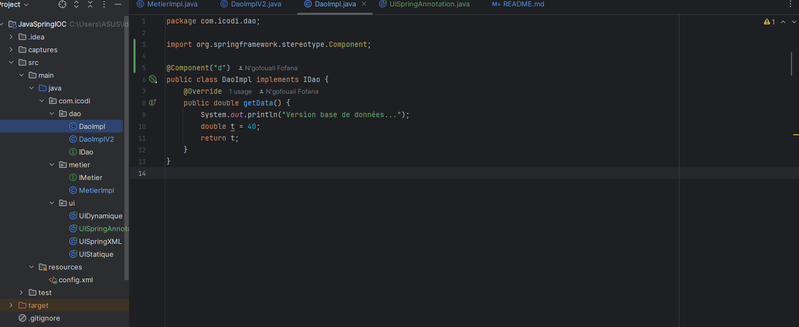
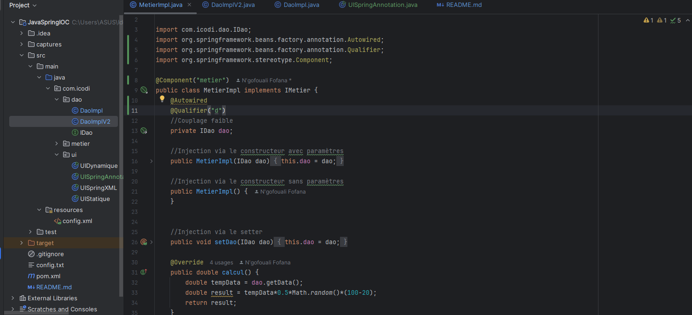
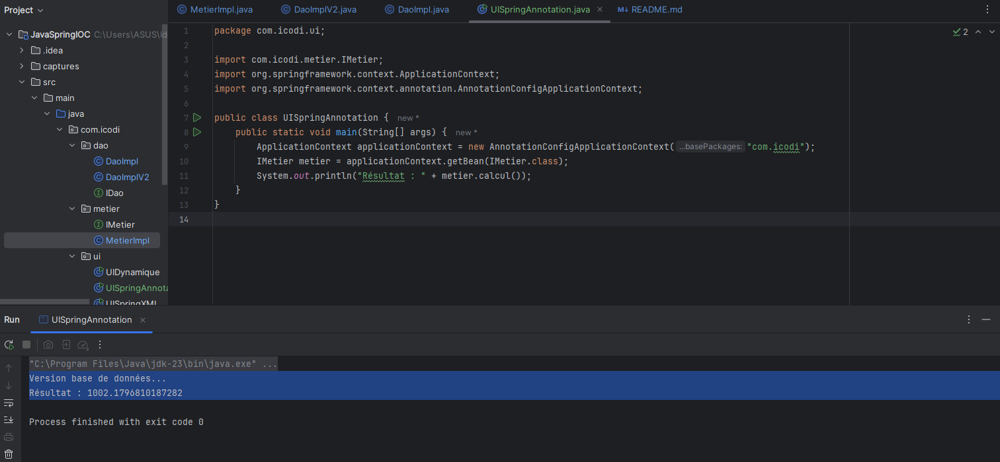

<h3>Création du projet et structure de base</h3>

<h3>Partie 1</h3>
<h3>1. Création de l'interface IDao avec une méthode getData</h3>

<h3>2. Création d'une implémentation de l'interface IDao</h3>

<h3>3. Création de l'interface IMetier</h3>

<h3>4. Création d'une implémentation de l'interface IMetier utilisant le couplage faible</h3>

<h3>5. Injection des dépendances</h3>
<h4>a. Par instanciation statique</h4>

<h4>b. Par instanciation dynamique</h4>
<ul>
<li> Création d'un fichier de configuration contenant les packages et une implémentation des interfaces IDao & IMetier</li>

 
<li> Création de la seconde couche présentation implémentant l'instanciation dynamique</li>

 
<li> Changement du ficheir de configuration pour prendre en compte la nouvelle version de l'interface IDao</li>

 
<li> Test après changement de la version du fichier de configuration</li>

</ul>
<h4>c. En utilisant le Framework Spring</h4>
<h5> Version XML </h5>
<ul>
<li>Création du fichier config.XML</li>

 
<li>Création de la nouvelle version de la couche présentation UISpringXML + Test</li>

 
<li>Modification du fichier de configuration pour la prise en compte de la nouvelle version de la couche Dao</li>

 
<li>Test de la UISpringXML avec la nouvelle implémentation de la couche Dao</li>

</ul>

<h5> Version Annotations </h5>
<ul>
<li>Annotation de implémentation de la couche dao avec @Component</li>

 
<li>Annotation de implémentation de la couche métier avec @Component + @Autowired + @Qualifier</li>

 
<li>Création de la nouvelle version de la couche présentation UISpringAnnotation + Test (version base de données)</li>

 
<li>Injection des dépendances via le constructeur (couche métier) et l'annotation @Qualifier (Version capteur)</li>

 
<li>Couche présentation UISpringAnnotation + Test Version capteur</li>

</ul>
 
 

<h3>Partie 2 : Mini projet (Framework Injection de dépendance)</h3>
