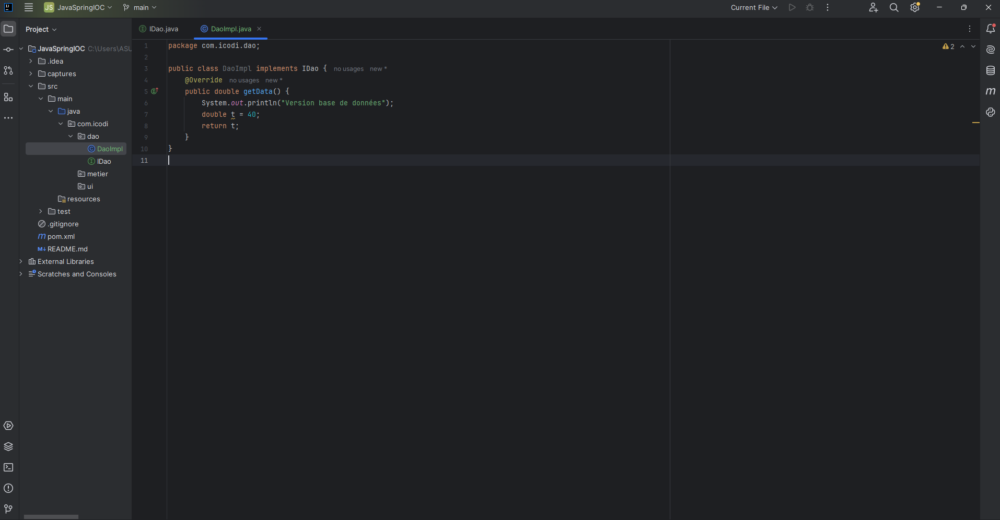
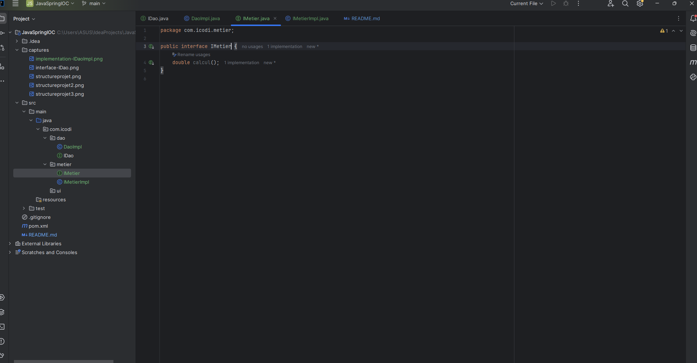

<h3>Création du projet et structure de base</h3>

<h3>1. Création de l'interface IDao avec une méthode getData</h3>

<h3>2. Création d'une implémentation de l'interface IDao</h3>

<h3>3. Création de l'interface IMetier</h3>
