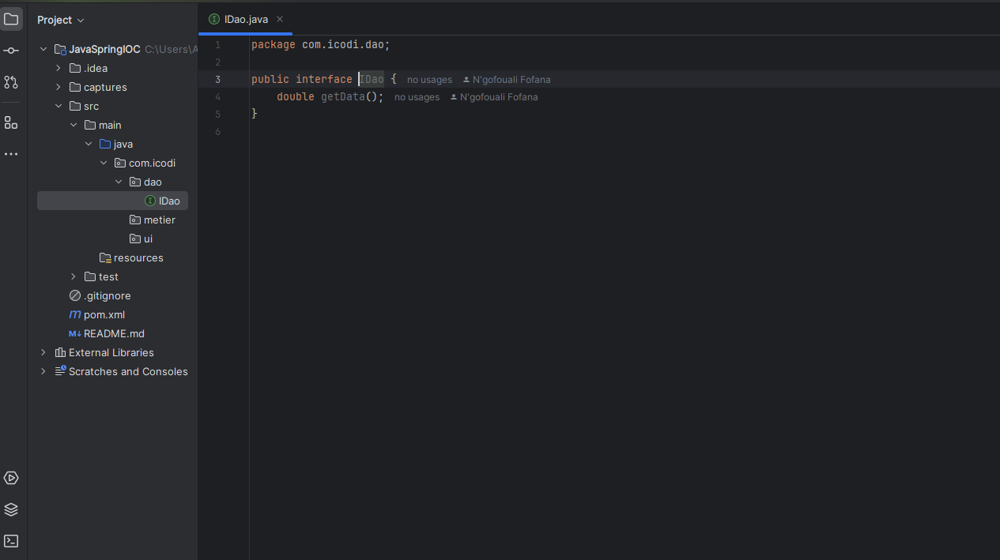

<h3>Création du projet et structure de base</h3>

<h3>1. Création de l'interface IDao avec une méthode getData</h3>

<h3>2. Création d'une implémentation de l'interface IDao</h3>

<h3>3. Création de l'interface IMetier</h3>

<h3>4. Création d'une implémentation de l'interface IMetier utilisant le couplage faible</h3>

<h3>5. Injection des dépendances</h3>
<h4>a. Par instanciation statique</h4>

<h4>b. Par instanciation dynamique</h4>
<ul>
<li> Création d'un fichier de configuration contenant les packages et une implémentation des interfaces IDao & IMetier</li>

 
<li> Création de la seconde couche présentation implémentant l'instanciation dynamique</li>

 
<li> Changement du ficheir de configuration pour prendre en compte la nouvelle version de l'interface IDao</li>

 
<li> Test après changement de la version du fichier de configuration</li>

</ul>
